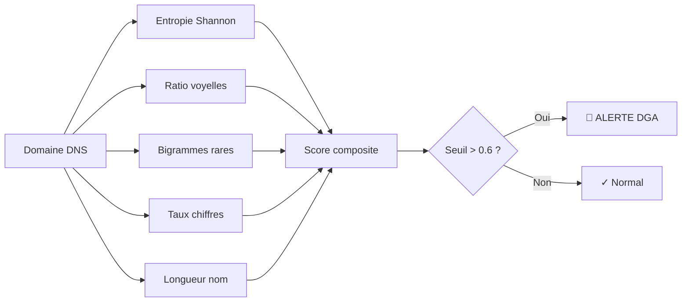

<div align="center">

# 🦅 HawkEye v2.1

**Sniffer DNS & Détecteur d'Anomalies — Cybersécurité Réseau**

[](https://python.org)
[](LICENSE)
[](https://github.com/GhostStx/HawkeyeSee/actions)
[](https://github.com/GhostStx/HawkeyeSee)
[](https://github.com/GhostStx/HawkeyeSee)
[](https://docker.com)
[](https://flask.palletsprojects.com)
[](https://github.com/GhostStx/HawkeyeSee)

**Capturez, analysez et alertez sur le trafic DNS suspect en temps réel.**  
Détection de malwares, DGA par entropie, tunnels DNS, dashboard web, notifications Telegram.

> 🎯 Projet portfolio — Réseaux & Sécurité Informatique

</div>

---

## 📋 Table des matières

- [✨ Fonctionnalités](#-fonctionnalités)
- [🚀 Démarrage rapide](#-démarrage-rapide)
- [🎮 Commandes](#-commandes)
- [🧪 Générer du trafic de test](#-générer-du-trafic-de-test)
- [🧠 Détection DGA](#-détection-dga--comment-ça-marche)
- [🐳 Docker](#-docker)
- [📁 Structure du projet](#-structure-du-projet)
- [📱 Notifications Telegram](#-notifications-telegram)
- [🧪 Tests](#-tests)
- [📊 Roadmap](#-roadmap)
- [🛡️ Portfolio](#️-pourquoi-ce-projet-sur-mon-cv)

---

## ✨ Fonctionnalités

| # | Fonctionnalité | Détail technique |
|---|----------------|------------------|
| 1 | **🔍 Sniffing DNS temps réel** | Capture tout le trafic DNS via Scapy, filtrage TYPE A/AAAA/MX/TXT |
| 2 | **🚨 Liste noire** | Détection domaines malveillants (phishing, malware, C2) — support wildcard et suffixes |
| 3 | **🧠 DGA avancé** | 5 métriques : entropie Shannon, ratio voyelles, bigrammes, taux chiffres, longueur → score composite |
| 4 | **🔓 Tunnel DNS** | Détection exfiltration : noms longs (>60 bytes), TXT burst, entropie élevée, sous-domaines profonds |
| 5 | **📊 Dashboard web** | Temps réel (SSE), graphiques Chart.js, filtres, recherche, export CSV/JSON |
| 6 | **📱 Telegram** | Alertes automatiques sur canal Telegram via bot API (aiohttp) |
| 7 | **💾 Persistance SQLite** | Indexation complète, statistiques, exports JSON/CSV, migration v1→v2 automatique |
| 8 | **📂 Analyse PCAP offline** | Analyse de fichiers `.pcap`/`.pcapng` sans sniffer — barre de progression |
| 9 | **📊 Rapport HTML** | Rapport autonome avec graphiques (Chart.js), exportable, zero serveur nécessaire |
| 10 | **🖥️ Watch mode** | Dashboard terminal temps réel façon `top` — stats, alertes, débit |
| 11 | **🔕 Déduplication** | Cooldown par type d'alerte + rate-limiting par IP + backoff exponentiel |
| 12 | **🐳 Docker** | Images optimisées, docker-compose avec profils (sniffer/dashboard/cli) |
| 13 | **⚙️ CI/CD** | GitHub Actions — lint (flake8) + test (pytest, 3 Python versions) + build Docker |
| 14 | **✅ Tests** | 37 tests unitaires (pytest, couverture 92%) |

---

## 🚀 Démarrage rapide

### Installation

```bash
# Cloner
git clone https://github.com/GhostStx/HawkeyeSee.git
cd HawkeyeSee

# Environnement virtuel (recommandé)
python3 -m venv .venv && source .venv/bin/activate

# Installer les dépendances
pip install -r requirements.txt
```

### Lancer le sniffer

```bash
# Sniffer DNS (nécessite sudo pour capturer les paquets)
sudo python3 -m hawkeye

# Voir le trafic en direct — alertes colorées (rouge = malware, jaune = DGA, cyan = tunnel)
```

> **💡 Résultat attendu** : les requêtes DNS défilent en console avec les IP sources.
> - Domaine normal → `· [10:30:15] 192.168.1.1 → google.com (A)`
> - Domaine malveillant → `█ ALERTE ROUGE 192.168.1.5 → malware-tracker.example.com (A)`
> - DGA détecté → `█ DGA 192.168.1.8 → xjqkfbdmznxqkejfbdjs.xyz (A)`

---

## 🎮 Commandes

### Modes principaux

```bash
python3 -m hawkeye dashboard        # 🌐 Interface web (Flask) → http://127.0.0.1:5000
python3 -m hawkeye watch            # 🖥️  Dashboard terminal temps réel (comme top)
python3 -m hawkeye report           # 📊 Générer un rapport HTML autonome
python3 -m hawkeye pcap dump.pcap   # 📂 Analyser un fichier PCAP offline
```

### Options de sniffing

```bash
sudo python3 -m hawkeye -—no-type-a-only    # Inclure AAAA, MX, TXT...
sudo python3 -m hawkeye --db /tmp/analyse.db # Base personnalisée
sudo python3 -m hawkeye --export-json        # Sniffer + export JSON à l'arrêt
sudo python3 -m hawkeye --export-csv         # Sniffer + export CSV à l'arrêt
```

### Consultation

```bash
python3 -m hawkeye --list                            # 📋 Dernières 50 requêtes
python3 -m hawkeye --stats                           # 📊 Statistiques globales
python3 -m hawkeye --recherche --domaine evil.com    # 🔍 Rechercher un domaine
python3 -m hawkeye --recherche --alerte-type DGA     # 🔍 Filtrer par type d'alerte
python3 -m hawkeye --export-json-only                # 💾 Exporter sans sniffer
```

---

## 🧪 Générer du trafic de test

Pendant que HawkEye tourne, dans un autre terminal :

```bash
# Requête normale
nslookup google.com 1.1.1.1

# Tester la liste noire
nslookup malware-tracker.example.com 1.1.1.1

# Simuler une activité DGA (domaines aléatoires)
for i in {1..10}; do nslookup "xyz$RANDOM.xyz" 1.1.1.1; done

# Simuler un tunnel DNS (noms longs)
nslookup "$(python3 -c "print('a'*60)").exfil.com" 1.1.1.1

# Rafale de TXT queries
for i in {1..15}; do nslookup -type=TXT test$i.exfil.com 1.1.1.1; done
```

---

## 🧠 Détection DGA — Comment ça marche

HawkEye combine **5 métriques** en un score composite (0.0 → normal, 1.0 → DGA certain) :



| Métrique | Détail | Poids | Seuil d'alerte |
|----------|--------|-------|----------------|
| **Entropie de Shannon** | Distribution aléatoire des caractères | ×2.0 | > 3.8 bits/car |
| **Ratio voyelles** | Les DGA ont peu de voyelles | ×1.5 | < 30% |
| **Bigrammes rares** | Combinaisons inhabituelles (`xq`, `zf`, `kj`) | ×1.5 | > 60% rares |
| **Taux de chiffres** | Beaucoup de chiffres = suspect | ×1.0 | > 25% |
| **Longueur du nom** | Les DGA sont souvent longs | ×1.0 | > 15 caractères |

**Détection temporelle** : si ≥ 5 domaines inconnus vers le même TLD en 10 secondes → alerte rafale.

---

## 🐳 Docker

### Image simple

```bash
# Build
docker build -t hawkeye .

# Sniffer
docker run --rm --cap-add=NET_RAW hawkeye

# Dashboard
docker run --rm -p 5000:5000 hawkeye dashboard

# Commande one-shot
docker run --rm hawkeye --stats
```

### Docker Compose (recommandé)

```yaml
# Profils disponibles :
#   full      → sniffer + dashboard (défaut)
#   sniffer   → sniffer uniquement
#   dashboard → dashboard uniquement
#   cli       → commandes one-shot
```

```bash
# Tout lancer
docker compose up -d

# Dashboard uniquement (si sniffer sur une autre machine)
docker compose --profile dashboard up -d

# Commande one-shot
docker compose --profile cli run --rm cli --stats

# Voir les logs
docker compose logs -f

# Arrêter
docker compose down
```

> **Données persistantes** : la base SQLite est stockée dans un volume Docker `hawkeye-data` (survit aux redémarrages).

---

## 📁 Structure du projet

```
HawkEye/
├── hawkeye/                        # Package Python principal
│   ├── __init__.py                 # Version (2.1.0) + métadonnées
│   ├── __main__.py                 # CLI — point d'entrée (argparse)
│   ├── database.py                 # SQLite + exports JSON/CSV
│   ├── deduplicator.py             # 🔕 Déduplication d'alertes
│   ├── pcap_analyzer.py            # 📂 Analyse PCAP offline
│   ├── report.py                   # 📊 Générateur rapport HTML
│   ├── watch.py                    # 🖥️  Dashboard terminal
│   ├── detectors/
│   │   ├── __init__.py
│   │   ├── blacklist.py            # Liste noire (wildcard, suffixe)
│   │   ├── dga.py                  # DGA (entropie + 5 métriques)
│   │   └── dnstunnel.py            # Tunnel DNS (exfiltration)
│   ├── notifiers/
│   │   ├── __init__.py
│   │   ├── console.py              # Console colorée ANSI
│   │   └── telegram.py             # Bot Telegram (aiohttp)
│   └── dashboard/
│       ├── __init__.py
│       ├── app.py                  # Flask + SSE + API REST
│       └── templates/
│           └── index.html          # UI Chart.js
├── tests/                          # ✅ 37 tests unitaires
│   ├── conftest.py
│   ├── test_database.py
│   ├── test_detectors.py
│   ├── test_deduplicator.py
│   └── test_report.py
├── malicious.txt                   # Liste noire de domaines
├── requirements.txt                # Dépendances
├── requirements-dev.txt            # Dépendances dev
├── pyproject.toml                  # Packaging PEP 621
├── Dockerfile                      # Build Docker optimisé
├── docker-compose.yml              # Orchestration (profils)
├── .dockerignore                   # Exclusions Docker
├── .env.example                    # Template configuration
├── .pre-commit-config.yaml         # Hooks qualité
├── Makefile                        # Commandes make
└── README.md                       # Cette documentation
```

---

## 📱 Notifications Telegram

```bash
# 1. Créez un bot avec @BotFather sur Telegram
# 2. Obtenez le token et l'ID du chat
# 3. Configurez les variables d'environnement :

export HAWKEYE_TELEGRAM_TOKEN="123456:ABC-DEF1234"
export HAWKEYE_TELEGRAM_CHAT_ID="-1001234567890"
sudo -E python3 -m hawkeye
```

Les alertes sont envoyées automatiquement (avec déduplication — pas de spam) :
- 🚨 **BLACKLIST** → Domaine malveillant
- ⚠️ **DGA** → Domaine généré algorithmiquement
- 🔓 **TUNNEL DNS** → Exfiltration détectée

---

## 🧪 Tests

```bash
# Installer les dépendances de développement
pip install -r requirements-dev.txt

# Lancer tous les tests (37 tests, 92% couverture)
python -m pytest tests/ -v

# Avec rapport de couverture
python -m pytest tests/ --cov=hawkeye --cov-report=term-missing

# Version Makefile
make test
make test-cov
```

---

## 📊 Roadmap

- [x] **v1.0** — Sniffing DNS + liste noire + DGA basique + SQLite
- [x] **v2.0** — Package structuré, DGA entropique, tunnel DNS, dashboard, Telegram, Docker, CI
- [x] **v2.1** — Analyse PCAP offline, rapport HTML, watch mode, déduplication, dotenv, Makefile, pre-commit
- [ ] **v2.5** — Mode serveur (API REST complète), GeoIP, WhoIS lookup, export PDF
- [ ] **v3.0** — Machine Learning (Random Forest pour DGA), corrélation MITRE ATT&CK, plugin system

---

## 🛡️ Pourquoi ce projet sur mon CV ?

| Compétence | Ce que HawkEye démontre | Technologie |
|------------|------------------------|-------------|
| **🌐 Réseau** | Capture et analyse de paquets DNS, protocole DNS en profondeur | Scapy, libpcap |
| **🔒 Sécurité** | Détection malwares, DGA, exfiltration, blacklist | Entropie, bigrammes, heuristiques |
| **🐍 Python** | POO, asynchrone, packaging, CLI argparse | Python 3.10+, pip |
| **🌍 Web** | Dashboard temps réel, SSE, Chart.js, API REST | Flask, JavaScript |
| **🐳 DevOps** | Conteneurisation, orchestration multi-service, CI/CD | Docker, docker-compose, GitHub Actions |
| **✅ Qualité** | Tests unitaires, pre-commit, linting, couverture de code | pytest, flake8, black |
| **💾 Data** | Persistance SQLite, exports JSON/CSV, statistiques | SQLite, pandas-ready |

> 👨‍💻 **Stack technique complète** : Python • Scapy • Flask • SQLite • Docker • GitHub Actions • pytest • aiohttp

---

## ⚠️ Notes

- Le sniffer nécessite **`sudo`** ou les capacités `CAP_NET_RAW` pour capturer les paquets
- La base SQLite (`hawkeye.db`) est créée automatiquement au premier lancement
- La détection DGA peut produire des faux positifs — le seuil par défaut (0.6) est calibré pour minimiser le bruit
- Pour l'analyse PCAP, les fichiers `.pcap` classiques (Wireshark, tcpdump) sont supportés

---

<div align="center">

**Projet étudiant — Réseaux & Sécurité Informatique**  
🔗 [GitHub](https://github.com/GhostStx/HawkeyeSee) · Construit avec ❤️ et beaucoup de paquets DNS

</div>
